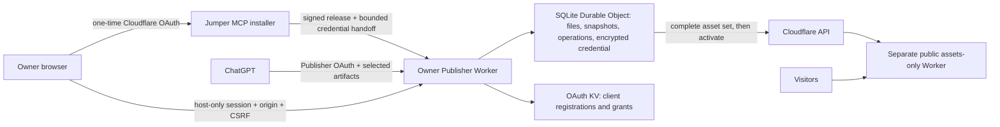

# ChatGPT-to-Public

A self-hosted Publisher for **personal pages; smallish projects that need immediate visibility**. Keep approved static website files in your own Cloudflare account, publish them at stable addresses, edit from later conversations, and undo a publication.

**Pre-release implementation. Not ready for a public launch.** Local tests exercise storage, ownership, OAuth, MCP, and failure handling. Real Cloudflare deployment, independent-account installation, ChatGPT file transfer, free-plan performance, and novice usability still require the [acceptance experiments](docs/acceptance.md). The operator has configured a public Cloudflare OAuth client. The installer and signed release downloads are deployed at [chatgpt-to-public.jumpermcp.dev](https://chatgpt-to-public.jumpermcp.dev/); end-to-end authorization and independent-account provisioning remain pending. The current code defaults to the API-token fallback; token-free onboarding is not a verified claim.

Project snapshots live in a SQLite-backed Durable Object. Cloudflare KV holds Publisher OAuth records. ChatGPT can request its normal confirmations; this is not a promise of a zero-click workflow or unlimited model payloads.

## Intended installation and everyday use

You need a Cloudflare account with permission to create Workers and KV namespaces, an activated `workers.dev` subdomain, and a ChatGPT account whose interface offers custom MCP connections. Free-tier ChatGPT compatibility has not been established. End users should not need GitHub, a terminal, a build service, or an OpenAI API key. Operator setup is separate: see [the operator runbook](docs/operator-setup.md).

1. Open `https://chatgpt-to-public.jumpermcp.dev` once the installer is deployed, then select **Install on my Cloudflare**.
2. Authorize Cloudflare account provisioning and choose an account. Installation progress persists across retries. If account verification or `workers.dev` activation is required, finish it in the dashboard and resume.
3. Open the short-lived setup link on your own Publisher and create the owner password. An arbitrary first visitor cannot claim it.
4. If independent OAuth refresh has not been verified, create an account-scoped **Workers Scripts Edit** API token and enter it directly in your Publisher. Do not send the token through ChatGPT. The UI validates account/subdomain access; deployment validates write access.
5. Use **ChatGPT → Plugins → Add → Create custom MCP server**, enter the Publisher's `/mcp` URL, sign in to the Publisher, and explicitly consent to project access. This is the target setup path; a recording from the tested interface is still required before launch. Callback registration remains disabled until exact callbacks have been verified and configured.
6. Publish only the reviewed artifacts. In a fresh chat, identify the site by project ID, name, or its saved URL and request an edit. Ask to undo to republish the preceding snapshot.

First-publish prompt:

> Publish only the website files I have explicitly selected and reviewed. These files will become public. Preserve their bytes, include the approved images, and stop if you cannot access an artifact. Do not reconstruct missing files or publish unrelated conversation content. Return the public URL and operation status. If this changes an existing project, read its current revision first.

The [recording checklist](docs/acceptance.md#recordings) specifies the README GIF and captioned setup video. They are intentionally absent until real successful UI sessions can be recorded.

## Supported content and limits

Upload ZIP archives or individual static files, or send bounded text changes. Include `index.html`. Compiled output from frontend frameworks is supported; builds, package installation, server code, application databases, teams, custom domains, and large media hosting are out of scope. Uploaded code is never executed in the Publisher.

| Limit | Configured value (free-account verification pending) |
| --- | --- |
| Projects | 20 |
| Files per project | 100 |
| Uncompressed project | 25 MiB |
| Individual file | 10 MiB |
| Retained file content, including staging | 250 MiB, deduplicated |
| Publication history | Latest 20 successful snapshots |
| Abandoned candidate lifetime | 24 hours |
| Inline text per file / MCP request body | 256 KiB / 1 MiB |
| Text response | Up to 16,000 characters with continuation |

Ordinary static routing is the default. `404.html` selects 404-page behavior; SPA fallback requires explicit intent. `_headers` and `_redirects` are validated and passed as direct-upload configuration, while their original files remain in snapshots and exports. V1 accepts relative header paths and up to 100 relative-source redirect rules; unsupported syntax is rejected. `.assetsignore` is rejected: remove unwanted files before uploading. `noindex` is an indexing request, not privacy or access control.

Account quotas are shared with your other Cloudflare resources. Name availability, verification, account naming, and acceptable-use requirements remain your responsibility. The code never enables billing or upgrades your plan. A `workers.dev` account subdomain may contain identifying information; change account naming through Cloudflare if needed. Hosting success does not guarantee identical rendering across browsers.

## How this reduces effort and how it is secured



**Everyday workflow.** [Project operations](src/projects.ts) share domain logic between MCP and the management UI. Discovery and revision-specific reads provide persistent files across conversations. Exact patches preserve unmentioned files and fail atomically unless every old string matches once. Candidate revisions are private until publication; a combined request stages and publishes using a payload-bound request key. Stable hostnames survive edits and undo. [Publication operations](src/cloudflare.ts) persist progress and resume through Durable Object alarms. A disconnected chat does not cancel deployment. ChatGPT owns its normal confirmation UI; there is no second website-publication confirmation screen in the Publisher. Tests: [project lifecycle](tests/projects.test.ts), [actual Worker/OAuth/MCP integration](tests/runtime.test.ts).

**Two authorization relationships.** Cloudflare authorization grants account provisioning/deployment capabilities; Publisher OAuth grants ChatGPT project access. [The installer](src/installer/worker.ts) implements public-client PKCE S256 and checks every configured required scope before provisioning. Its Cloudflare OAuth client must separately be promoted to public visibility. Credential handoff is gated on an operator-recorded independent refresh experiment. In fallback mode, the installer erases its temporary credential and the owner enters a scoped API token on their own Publisher. The installer records a one-hour expiry, schedules cleanup, and erases the credential and temporary encryption/handoff secrets after success. It never requests token-creation permissions.

[Owner authentication and credentials](src/security.ts) use a short-lived single-use setup token, salted PBKDF2 password verification, login throttling, expiring sessions, and AES-GCM credential encryption with a key in Worker secrets. Refreshes are serialized, and replacement credentials are stored before using the access token. Interrupted rotations require reconnection because remote rotation and local persistence cannot be atomic. There is no speculative periodic refresh cron. Password recovery invalidates owner sessions and existing MCP authorization epochs. Encryption at rest does not protect against malicious Publisher code or a compromised Cloudflare account. Tests: [security](tests/security.test.ts).

**Trust boundaries.** The installer sees a temporary Cloudflare grant and installation resource identifiers; routine website files, edits, and visitor traffic do not pass through it. Each website has a separate public origin and no Publisher credentials, bindings, or application Worker script in its deployment metadata. Owner cookies use the `__Host-` prefix, Secure, HttpOnly, Path=/, and SameSite. Exact-origin and CSRF checks protect writes even against sibling websites, which can be same-site. Duplicate owner cookies are rejected. [OAuth registration policy](src/oauth-policy.ts) accepts only exact configured callbacks and public clients. The owner sees explicit consent, a self-reported client identity warning, and the actual callback; the provider validates PKCE and token audience, while handlers enforce scope and owner epoch. CIMD is disabled until the real connection experiment establishes a need. Callback allowlisting does not by itself prove a client's identity.

**Artifact transfer.** [File handling](src/files.ts) allows only HTTPS hosts explicitly approved by the operator and revalidates each redirect. Downloads have deadlines and streaming byte limits. ZIP processing bounds expanded content, rejects traversal, symlinks, encrypted archives, duplicate normalized paths and unsupported build inputs, and never runs uploaded code. Missing or expired references produce an attach/export instruction. Binary assets use ZIP export rather than oversized tool output. File hosts and ChatGPT callbacks are empty by default. Tools declare top-level authorized file inputs. Retrieved text is untrusted content. MCP annotations and model instructions guide the workflow but are not authorization or complete prompt-injection defenses. Provider errors are sanitized, and application code does not log credentials or signed download URLs. Tests: [files](tests/files.test.ts).

**Data integrity.** [SQLite storage](src/store.ts) keeps SHA-256-addressed immutable content in 512 KiB chunks. Revisions capture files and serving settings together. Transactions enforce capacity before committing. Publication serializes each project's changes, rechecks its base, uploads all assets before activation, records version/deployment IDs, and reconciles a lost activation response. Uncertain activation stays in reconciliation rather than falsely reporting failure. Activated sites with delayed reachability remain marked published, with an explicit reachability warning. Collection preserves the current publication, retained history, and active operations. Unpublish retains editable files; confirmed deletion removes the installation-owned deployment and stored project files. Five-minute export links are bearer capabilities: anyone with a link can download until it expires. Public copies and caches cannot be recalled.

**Updates and supply-chain trust.** [Release verification](src/releases.ts) checks an Ed25519 signature against an installation-configured trust root, module checksums, compatibility, migration tag, and class identity. [Owner-approved updates](src/updates.ts) persist before upload, reverify the stored bundle, inherit configuration/bindings, explicitly preserve secret bindings, and do not replay creation migrations. The current updater accepts schema/tag v1 only. Website content is untouched. The release script requires a clean committed source tree; dependencies are pinned and locked. A release signer and installer remain trusted: a valid signature or build provenance does not prove safety or prove what a hosted installer deployed. Compare downloaded deployed modules with the numbered release and inspect source independently. Actual secret preservation, post-update decryption, and dashboard recovery still need live tests. Keep a known-good release; code rollback does not undo database changes. Tests: [release verification](tests/releases.test.ts).

Existing website delivery is independent of the installer. Publisher code has no installer endpoint dependency for ordinary project operations; local tests use only its own storage and provider adapter. Live installer-outage testing is pending. Revoking the Cloudflare OAuth application is different from installer downtime and can require reconnection or a fallback token.

## Development

Use Node.js 24 or newer:

```sh
npm ci
npm run check
npm run build
npm test
npm run format:check
```

`npm run build` is a **dry run**, not a deployment. Runtime integration tests need a local workerd process and loopback sockets. On NixOS, supply a compatible launcher through `MINIFLARE_WORKERD_PATH`; the npm workerd binary requires the normal Linux dynamic linker. Set `WRANGLER_LOG_PATH` to a writable path in a restricted environment.

Configure a development copy of `wrangler.jsonc`, create your own OAuth KV namespace, and provide secrets through ignored `.dev.vars` or Wrangler secrets. Do not deploy the placeholder configuration. The [operator runbook](docs/operator-setup.md) lists every required setting, the public client setup, release signing, and scope verification. `wrangler.installer.jsonc` builds the separate installer. `npm run build:installer` also performs a dry run.

## Recovery, troubleshooting, and uninstall

See [recovery and uninstall](docs/recovery.md). Common problems:

- **Conflict:** retrieve the latest project and stage the change against its current revision.
- **Rewrite warning:** read the candidate and clarify intent before acknowledging the warning. Bytes are never silently repaired.
- **Unavailable hostname:** choose another name. Unrelated Workers must not be overwritten.
- **Missing artifact:** export/attach the original ZIP or file again; do not ask the model to recreate it silently.
- **Authorization/rotation failure:** reconnect Cloudflare in the owner UI. Keep the original encryption key when recovering or updating.
- **Quota refusal:** export and remove unused projects or manage your shared account resources. The current publication is preserved.
- **Activated, awaiting reachability:** inspect the operation and retry the public address later; this differs from upload failure.

## Alternatives

| Approach | Advantages | Tradeoffs relative to this project |
| --- | --- | --- |
| [Manual static upload](https://developers.cloudflare.com/pages/get-started/direct-upload/) | Simple dashboard upload of already-built files; direct account ownership | Repeat artifact transfer for each edit; no integrated chat project memory |
| [Git-based deployment](https://developers.cloudflare.com/pages/configuration/git-integration/) | Repository history and automated deployments from commits | Requires a repository and build/deployment setup; preferable when collaboration and review are central |
| [Hosted AI website builders](https://docs.lovable.dev/features/publish) | Integrated creation, publishing, and hosted product experience | Platform-specific workflow and hosting choices; this project instead focuses on the owner's Cloudflare account and future chat editing |
| This Publisher | Persistent static artifacts, stable URLs, exact patches, chat editing, undo, and export in your account | One-time setup, shared quotas, static-only scope, and self-hosted maintenance; launch gates remain open |

MIT licensed. [Technical plan](PRD/technical-plan.md) is the implementation reference; the original brainstorm, notes, and independent review remain unchanged historical documents.
