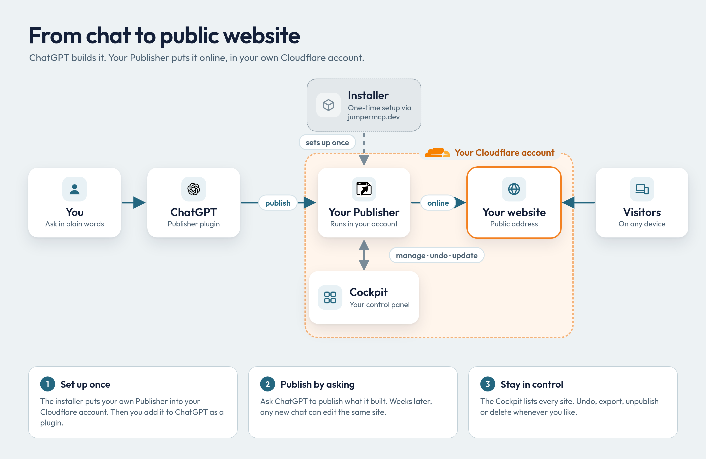
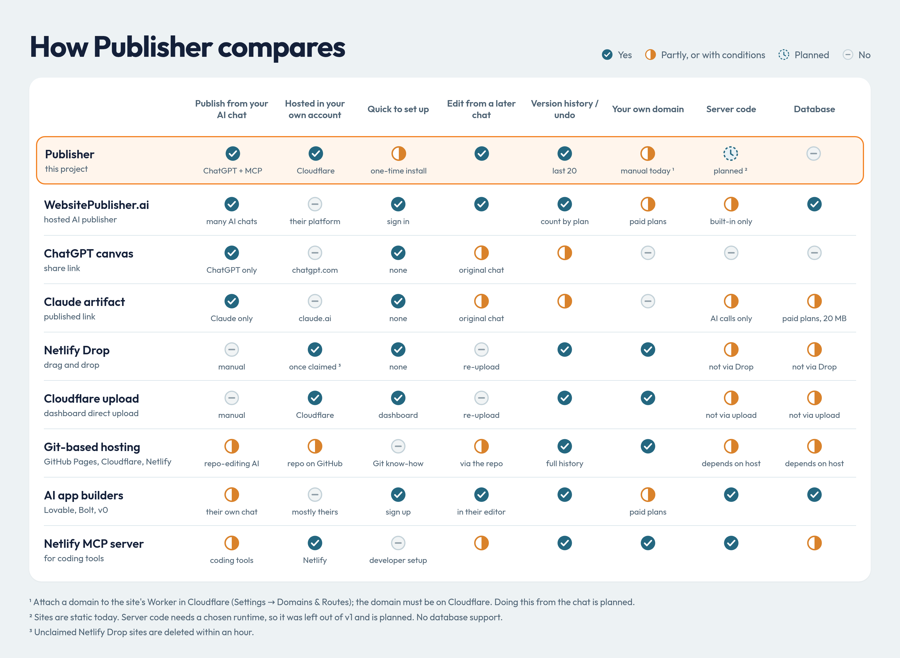
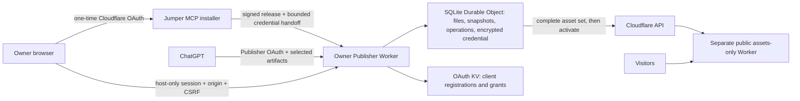

# Publisher for ChatGPT

Ask ChatGPT for a web page, get a public address, and come back weeks later in a new chat to change it. The pages live in **your own Cloudflare account**, on the free plan. Made for personal pages and smallish projects that need to be visible right away.

You already swapped coding for prompting. Publisher drops the next chore: downloading files, finding a host, and uploading again for every small fix.

**Install:** [chatgpt-to-public.jumpermcp.dev](https://chatgpt-to-public.jumpermcp.dev/) · **Example site:** [pants-math.snlr308.workers.dev](https://pants-math.snlr308.workers.dev/) · **Contents:** [Part 1, for everyone](#part-1-for-everyone) · [How it compares](#how-it-compares) · [Part 2, for technical readers](#part-2-for-technical-readers)



---

# Part 1: For everyone

## What it does

You ask ChatGPT: *"Create a website about a new science called Pants Math, with a widget where visitors test pants hypotheses. Publish it on my website."* It writes the site, hands it to your Publisher, and replies with an address like `https://pants-math.<your-name>.workers.dev`.

A month later, in a fresh chat, maybe on your phone: *"Make the pants-math background blue."* ChatGPT finds the site, changes only that, and republishes at the same address. Don't like it? Ask it to undo.

No GitHub, terminal, build step, or OpenAI API key. Depending on your ChatGPT settings, it may ask you to confirm a publish.

## Watch it

| One-time setup | Everyday use |
|:-:|:-:|
| [](https://www.youtube.com/watch?v=s7Oz0lrCuuE) | [](https://www.youtube.com/watch?v=P0WYFshgFnc) |
| [How to install](https://www.youtube.com/watch?v=s7Oz0lrCuuE) | [Everyday use](https://www.youtube.com/watch?v=P0WYFshgFnc) |

## What you need

- A Cloudflare account where you can create Workers and KV namespaces. The free plan is enough. If Cloudflare asks you to verify the account or switch on `workers.dev`, the installer waits until you have.
- A ChatGPT account, free or paid. Free accounts first switch on **Developer mode** under Settings → Security and login.

Claude Desktop, Cursor and other MCP clients connect the same way; ChatGPT is the one we test against.

## Set it up once

1. Open [chatgpt-to-public.jumpermcp.dev](https://chatgpt-to-public.jumpermcp.dev/), choose **Install on my Cloudflare**, sign in to Cloudflare and pick an account. If you're interrupted, it resumes where it stopped.
2. Open the setup link it shows you and create your password. The link is single-use and expires quickly, so nobody else can claim your Publisher.
3. In your Publisher's **Cloudflare settings**, add a Cloudflare API token with **Workers Scripts Edit** permission. The page walks you through creating it. Paste it there only, never into ChatGPT.
4. In ChatGPT, open **Plugins → Add → Custom MCP server** and paste the MCP URL from your Publisher's **ChatGPT connection** panel, including `/mcp` at the end. Sign in and approve access.

## Everyday use

Just ask. Name a site, give its project ID, or paste its address in any new chat to edit it; you don't need to find the original conversation. Ask to undo, and the previous version goes back online.

Your Publisher's control panel lists every site. From there you can unpublish (the site goes offline, the files stay), export, delete, and choose when to update the Publisher itself.

Two safety nets work in the background. If ChatGPT tries to rewrite far more than you asked for (the classic "rest of the code unchanged"), the Publisher flags it instead of publishing. And two chats editing the same site can't silently overwrite each other.

If you want ChatGPT extra careful on a first publish, add this:

> Publish only the website files I have explicitly selected and reviewed. These files will become public. Preserve their bytes, include the approved images, and stop if you cannot access an artifact. Do not reconstruct missing files or publish unrelated conversation content. Return the public URL and operation status. If this changes an existing project, read its current revision first.

## What it can host

Finished websites: HTML, CSS, JavaScript, images and other small files, loose or as a ZIP, with an `index.html`. React or Vue sites work if you upload the built output.

Not supported: databases, large videos, or teams. Server code is planned. Your own domain works if you attach it to the site in Cloudflare; doing it from the chat is planned. Uploaded files are served, never run.

Limits: 20 sites of up to 100 files and 25 MB each, files up to 10 MB, the last 20 versions of each site kept for undo.

## Cost and privacy

- Publisher is free and MIT licensed. It never turns on billing or upgrades your Cloudflare plan, but it does share your account's free allowance with whatever else runs there.
- Your sites and their traffic never pass through Jumper MCP, which only provides the installer. Existing sites keep working even if the installer goes down.
- Everything you publish is public, and copies can't be recalled. A "noindex" request doesn't make a page private.
- Your `workers.dev` address may include part of your name or email. Cloudflare lets you change it.
- Site names, account verification, and Cloudflare's acceptable-use rules are between you and Cloudflare.

## When something goes wrong

- **Name taken:** ChatGPT asks you for another name. The Publisher never overwrites a site it didn't create.
- **ChatGPT can't find your file:** attach it again rather than letting it recreate the file from memory.
- **Published but not loading yet:** try again in a few minutes; the upload itself succeeded.
- **Out of space:** export and delete old sites. Live sites are never removed to make room.
- **Publishing says the token is missing:** add it in your Publisher's Cloudflare settings (step 3).

Everything else, including uninstalling: [recovery and uninstall](docs/recovery.md).

---

## How it compares

No option wins everywhere, and for some needs another one is the better pick. Checked October 2026; competitors change quickly, so check their docs.



<details>
<summary>The same comparison as a text table, with links</summary>

<sub>✅ yes · 🟡 partly, or with conditions · 🔜 planned · ❌ no</sub>

| | Publish from your AI chat | Hosted in your own account | Quick to set up | Edit from a later chat | Version history / undo | Your own domain | Server code | Database |
|---|:-:|:-:|:-:|:-:|:-:|:-:|:-:|:-:|
| **[Publisher](https://chatgpt-to-public.jumpermcp.dev/)** (this project) | ✅ ChatGPT + MCP | ✅ Cloudflare | 🟡 one-time install | ✅ | ✅ last 20 | 🟡 manual today ¹ | 🔜 planned ² | ❌ |
| **[WebsitePublisher.ai](https://www.websitepublisher.ai/)** (hosted AI publisher) | ✅ many AI chats | ❌ their platform | ✅ sign in | ✅ | ✅ count by plan | 🟡 paid plans | 🟡 built-in only | ✅ |
| **[ChatGPT canvas](https://help.openai.com/en/articles/9930697-what-is-canvas)** (share link) | ✅ ChatGPT only | ❌ chatgpt.com | ✅ none | 🟡 original chat | 🟡 | ❌ | ❌ | ❌ |
| **[Claude artifact](https://support.claude.com/en/articles/9547008-publish-and-share-artifacts)** (published link) | ✅ Claude only | ❌ claude.ai | ✅ none | 🟡 original chat | 🟡 | ❌ | 🟡 AI calls only | 🟡 paid plans, 20 MB |
| **[Netlify Drop](https://app.netlify.com/drop)** (drag and drop) | ❌ manual | ✅ once claimed ³ | ✅ none | ❌ re-upload | ✅ | ✅ | 🟡 not via Drop | 🟡 not via Drop |
| **[Cloudflare upload](https://developers.cloudflare.com/pages/get-started/direct-upload/)** (dashboard direct upload) | ❌ manual | ✅ Cloudflare | ✅ dashboard | ❌ re-upload | ✅ | ✅ | 🟡 not via upload | 🟡 not via upload |
| **[Git-based hosting](https://developers.cloudflare.com/pages/configuration/git-integration/)** (GitHub Pages, Cloudflare, Netlify) | 🟡 repo-editing AI | 🟡 repo on GitHub | ❌ Git know-how | 🟡 via the repo | ✅ full history | ✅ | 🟡 depends on host | 🟡 depends on host |
| **[AI app builders](https://docs.lovable.dev/features/custom-domain)** (Lovable, Bolt, v0) | 🟡 their own chat | ❌ mostly theirs | ✅ sign up | ✅ in their editor | ✅ | 🟡 paid plans | ✅ | ✅ |
| **[Netlify MCP server](https://github.com/netlify/netlify-mcp)** (for coding tools) | 🟡 coding tools | ✅ Netlify | ❌ developer setup | 🟡 | ✅ | ✅ | ✅ | 🟡 |

<sub>¹ Attach a domain to the site's Worker in Cloudflare (Settings → Domains & Routes); the domain must be on Cloudflare. Doing this from the chat is planned.</sub><br>
<sub>² Sites are static today. Server code needs a chosen runtime, so it was left out of v1 and is planned. No database support.</sub><br>
<sub>³ Unclaimed Netlify Drop sites are deleted within an hour.</sub><br>

</details>

**Pick something else** for a quick throwaway link (canvas or Claude artifact, zero setup), for logins or a database (WebsitePublisher.ai or an AI app builder), for team review and full history (Git), or for rare edits you don't mind dragging into a browser (Netlify Drop, Cloudflare upload).

**Pick Publisher** if you work in ChatGPT and want a stable address in an account you control, editable from any future chat.

---

# Part 2: For technical readers

## Verification

Current release: 0.1.12, signed and served from the installer domain ([release notes](docs/release-notes.md)). An independent tester on a separate Cloudflare account completed installation, owner setup, ChatGPT connection, publishing, and discovery plus editing from an unrelated smartphone session, and updated through several releases. Not yet measured: file and generated-image transfer from ChatGPT attachments, Cloudflare OAuth refresh (hence the API token in setup step 3), and free-plan CPU and memory under the maximum limits. Details: [acceptance ledger](docs/acceptance.md). To run your own installer: [operator runbook](docs/operator-setup.md).

## Architecture



Snapshots live in a SQLite-backed Durable Object; KV holds only OAuth records. Each site is a separate assets-only Worker without Publisher credentials or bindings. Content and visitor traffic never pass through the installer, and ordinary publishing doesn't call it. Revoking the Cloudflare OAuth app is different from installer downtime and can require reconnecting.

## Limits and serving rules

| Limit | Value |
| --- | --- |
| Projects / files per project | 20 / 100 |
| Uncompressed project / single file | 25 MiB / 10 MiB |
| Retained content incl. staging | 250 MiB, deduplicated |
| Publication history | Latest 20 successful snapshots |
| Abandoned candidate lifetime | 24 hours |
| Inline text per file / MCP request body | 256 KiB / 1 MiB |
| Text response | 16,000 characters, with continuation |

Static routing by default; `404.html` enables 404 behavior; SPA fallback must be explicit. `_headers` (relative paths) and `_redirects` (up to 100 relative-source rules) are validated and passed as direct-upload config, and kept in snapshots and exports. Unsupported syntax and `.assetsignore` are rejected.

## Security model

- **Two separate authorizations.** Cloudflare authorization lets the Publisher deploy; Publisher OAuth lets ChatGPT reach projects. The [installer](src/installer/worker.ts) uses public-client PKCE S256, checks required scopes before provisioning, never asks for token-creation rights, and erases its temporary credential after handoff or a one-hour expiry. Publishing then uses an account-scoped API token the owner enters on their own Publisher; OAuth refresh handoff stays off until it is verified.
- **Owner access** ([security.ts](src/security.ts)): single-use setup token, salted PBKDF2, throttling, expiring `__Host-` cookies, exact-origin and CSRF checks on writes (sibling sites are same-site). Credentials are AES-GCM encrypted with a key in Worker secrets; refreshes are serialized, replacements stored before use, and an interrupted rotation asks you to reconnect. Recovery invalidates sessions and MCP grants. Encryption at rest won't help against malicious Publisher code or a compromised account.
- **ChatGPT access** ([oauth-policy.ts](src/oauth-policy.ts)): exact configured callbacks and public clients only; consent shows the self-reported client and the real callback. The provider validates PKCE and token audience; handlers enforce scope and the owner epoch. CIMD is off until needed. An allowlist alone doesn't prove client identity.
- **Files** ([files.ts](src/files.ts)): operator-approved HTTPS hosts only (the list starts empty), redirects revalidated, deadlines and streaming byte limits. ZIPs: bounded expansion; traversal, symlinks, encryption, duplicate paths and build inputs rejected. Missing or expired references return an attach/export instruction, and binary assets leave via ZIP export rather than oversized tool output. Retrieved text is untrusted; MCP annotations guide the model but are no prompt-injection defense. Provider errors are sanitized; credentials and signed URLs are never logged.

## Data integrity

MCP and the owner UI share one [project layer](src/projects.ts). [Storage](src/store.ts) keeps immutable SHA-256-addressed 512 KiB chunks; a revision captures files and serving settings together, and capacity is checked inside the transaction. Patches apply only if every old string matches exactly once. Candidate revisions stay private until published, and a combined stage-and-publish call is deduplicated by a payload-bound request key. [Publication](src/cloudflare.ts) is serialized per project, rechecks its base revision, uploads all assets before activating, records version and deployment IDs, resumes via Durable Object alarms (closing the chat doesn't cancel it), and reconciles lost activation responses rather than reporting false failures. Cleanup never touches the live publication, retained history, or active operations. Confirmed deletion removes the installation-owned deployment and its stored files. Export links are five-minute bearer links: anyone holding one can download until it expires.

## Updates and supply chain

[Releases](src/releases.ts) are checked against an Ed25519 trust root, module checksums, compatibility, migration tag and class identity. [Owner-approved updates](src/updates.ts) persist before upload, re-verify the stored bundle, keep bindings and secrets, never replay creation migrations, and leave site content alone. The updater currently accepts schema/tag v1 only. Releases require a clean committed source tree, with pinned and locked dependencies. The release signer and installer remain trusted parties. A valid signature doesn't prove safety or what a hosted installer deployed; compare deployed modules with the numbered release, or have an agent audit the source before installing. Code rollback doesn't undo database changes, so keep a known-good release.

## Operation states worth knowing

- **Conflict:** the project moved on; read the latest revision and stage the change against it.
- **Rewrite warning:** read the candidate and clarify intent before acknowledging. Bytes are never silently repaired.
- **Authorization or rotation failure:** reconnect Cloudflare in the owner UI, keeping the original encryption key.
- **Activated, awaiting reachability:** the deployment is live on Cloudflare's side; retry the address later.

## Development

Node.js 24 or newer:

```sh
npm ci
npm run check
npm run build      # dry run, not a deployment
npm test
npm run format:check
```

Runtime tests need local workerd and loopback sockets. On NixOS set `MINIFLARE_WORKERD_PATH` to a compatible launcher, since the npm workerd binary expects the standard Linux dynamic linker; in restricted environments set `WRANGLER_LOG_PATH`. Use your own `wrangler.jsonc` copy, OAuth KV namespace, and secrets (ignored `.dev.vars` or Wrangler secrets); never deploy the placeholder config. The installer builds from `wrangler.installer.jsonc` (`npm run build:installer`, also a dry run). The [operator runbook](docs/operator-setup.md) lists every required setting, the public OAuth client setup, release signing, and scope verification.

Tests: [projects](tests/projects.test.ts), [runtime/OAuth/MCP](tests/runtime.test.ts), [security](tests/security.test.ts), [files](tests/files.test.ts), [releases](tests/releases.test.ts).

---

MIT licensed. Built by [Jumper MCP](https://jumpermcp.dev/). The [technical plan](PRD/technical-plan.md) is the implementation reference; the brainstorm, notes and review in `PRD/` are kept as historical documents.
